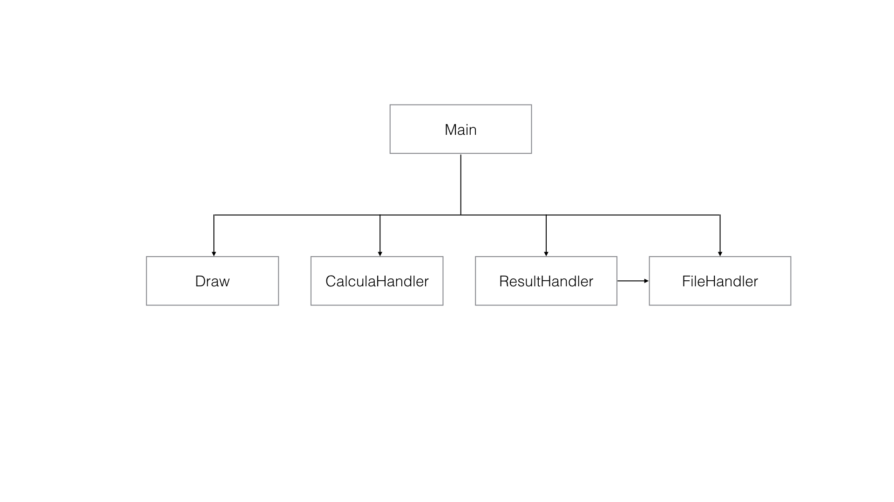

# INF1629 - G1
INF1629 - Trab 1

O programa lê um arquivo (.txt) com a matrícula e as notas dos alunos e calcula a média. Em seguida, ele gera um relatório e exibe para o usuário
a situação do aluno. Se a média for maior ou igual a 5, o aluno está aprovado, do contrário, está reprovado. 

## Diagrama

## Livro diário
08/04 - Estudo da linguagem Lua

09/04 - Definição do tema do projeto

10/04 - Criação do repositório

10/04 - Criação do diagrama do projeto

11/04 - Criação das funções e suas respectivas documentações

11/04 - Testes

11/04 - Correções da Documentação